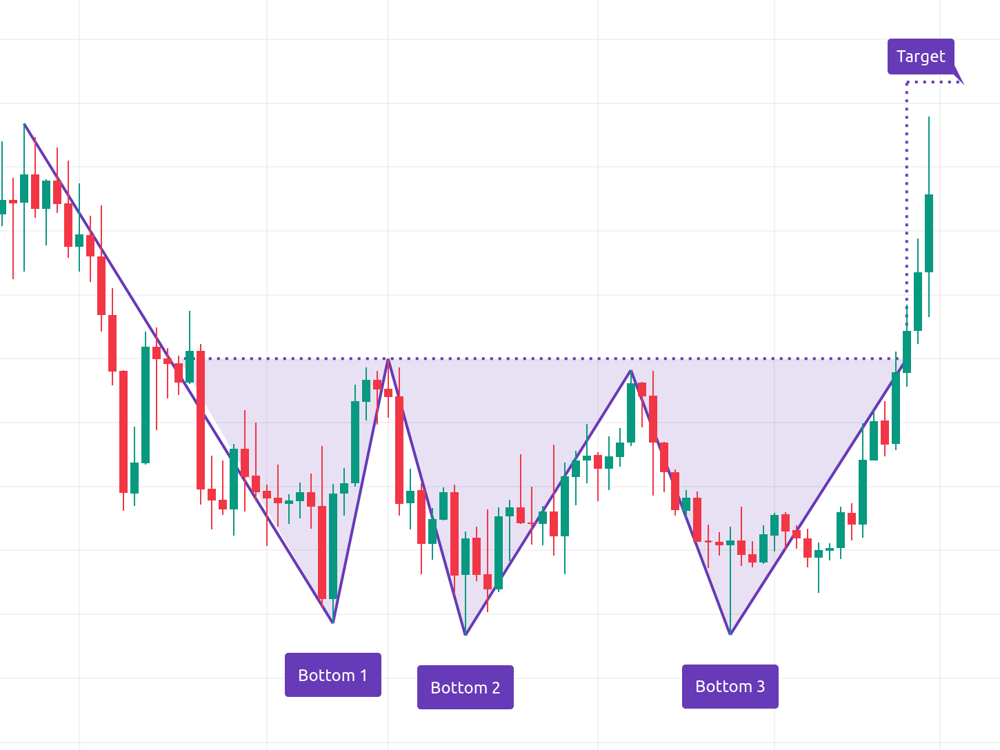
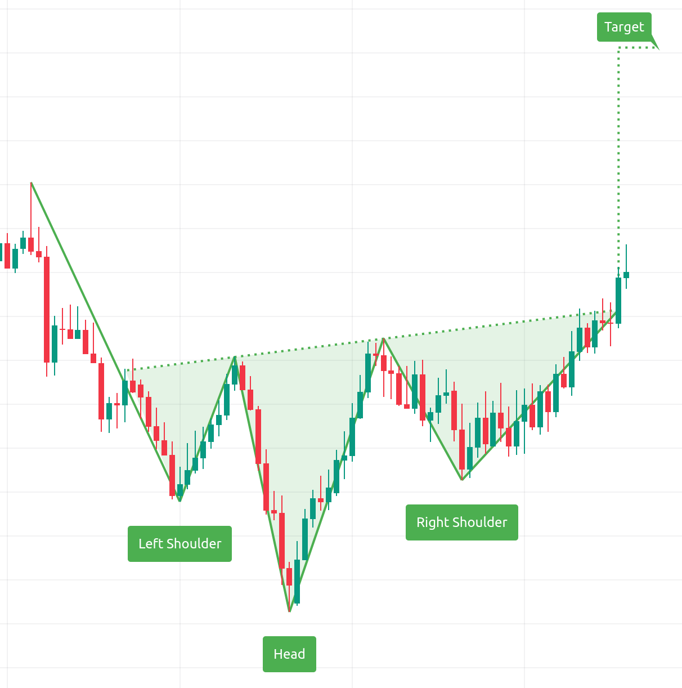
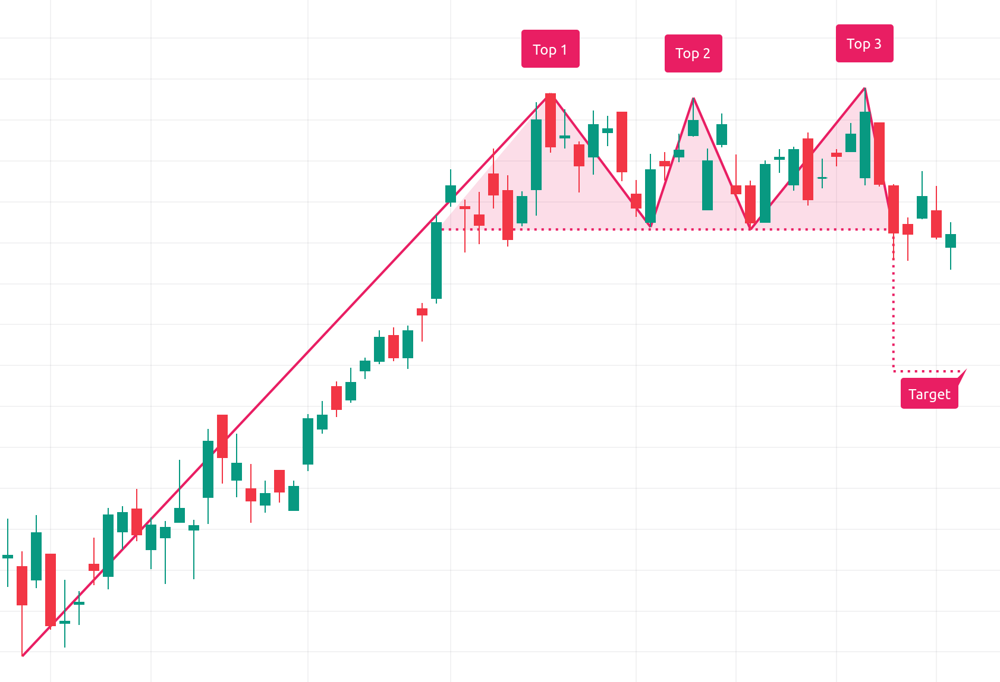
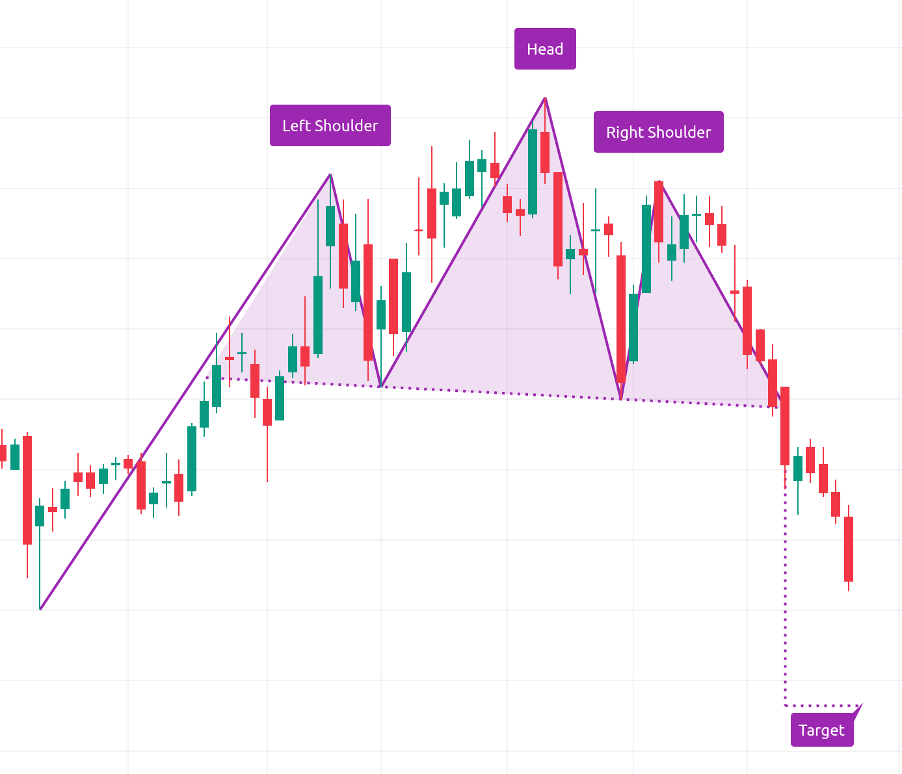
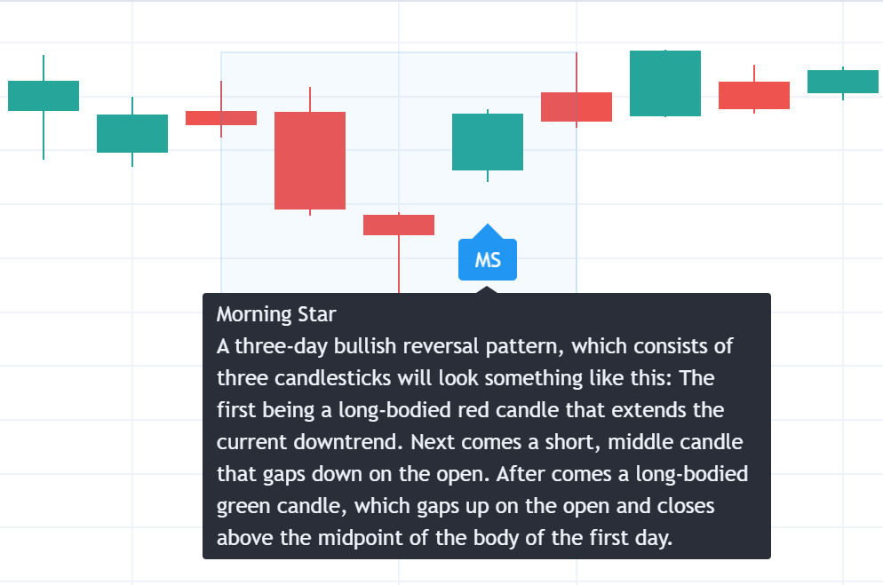
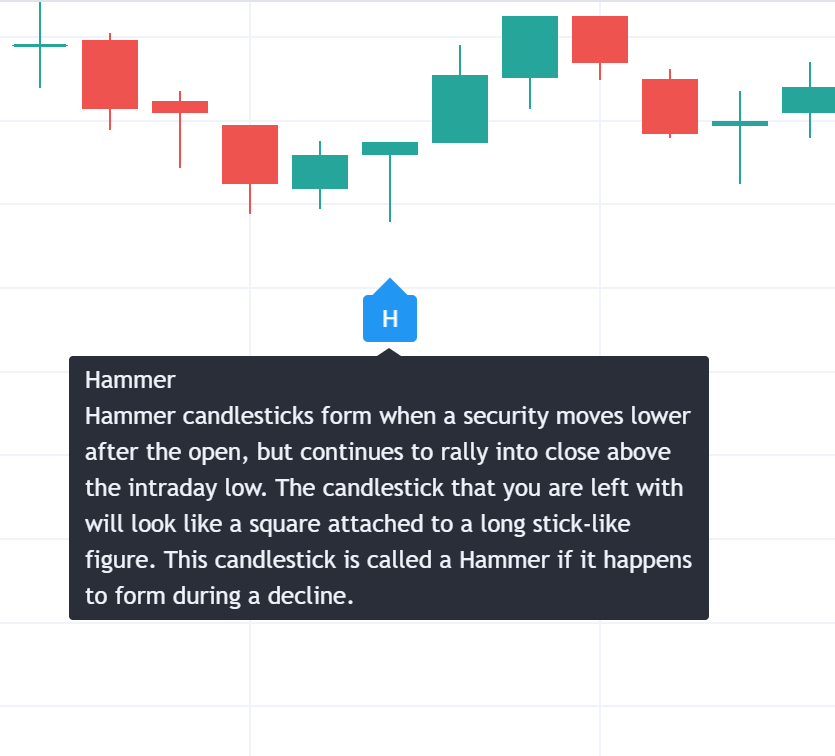
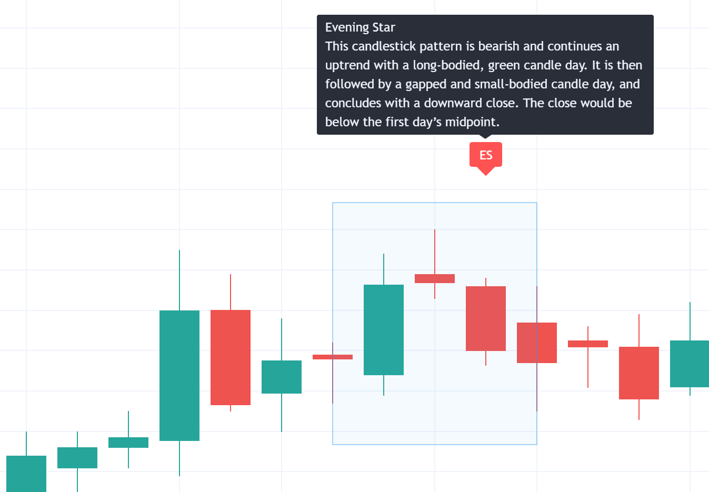
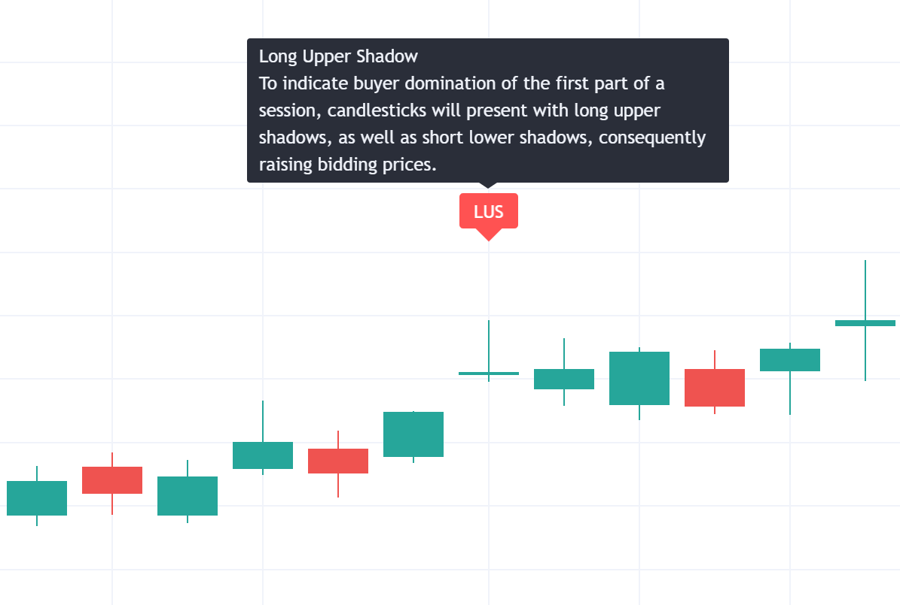

# Chart figures

When checking the chart of a stock, we can find some figures that can help us to predict the future trend of the stock.

## Trend change figures

### Slow trend change figures

* **Bullish trend change figures**
    * *Double bottom*: is a grafic pattern that indicates that the price is going to go up
        
    * *Triple bottom*: is a grafic pattern that indicates that the price is going to go up
        
    * *Inverse head and shoulders*: is a grafic pattern that indicates that the price is going to go up
        
* **Bearish trend change figures**
    * *Double top*: is a grafic pattern that indicates that the price is going to go down
        
    * *Triple top*: is a grafic pattern that indicates that the price is going to go down
        
    * *Head and shoulders*: is a grafic pattern that indicates that the price is going to go down
        

### Fast trend change figures

* **Bullish trend change figures**
    * *Engulfing bullish*: is a grafic pattern that indicates that the price is going to go up
        
    * *Morning star*: is a grafic pattern that indicates that the price is going to go up
        
    * *Hammer*: is a grafic pattern that indicates that the price is going to go up
        
* **Bearish trend change figures**
    * *Engulfing bearish*: is a grafic pattern that indicates that the price is going to go down
        
    * *Evening star*: is a grafic pattern that indicates that the price is going to go down
        
    * *Long Upper Shadow*: is a grafic pattern that indicates that the price is going to go down
        

## Trend continuation figures

The trend continuation figures are figures that indicates that the trend is going to continue. We have:

* Triangle
    * Symmetrical
    * Ascending
    * Descending
* Rectangle
